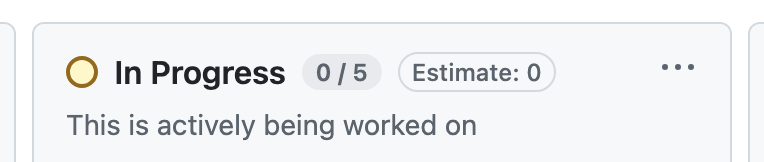
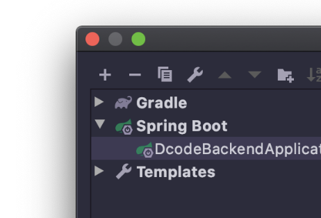
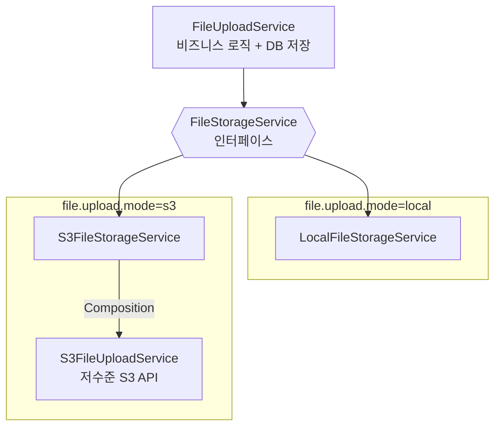

# 이건 바로 본문 시작인듯

폴더명에 한글은 안되나? -> 되는데 공백때문에 안됐던듯
# H1

## H2

### H3





<div>


</div>

test2



```java
public void main() {
	log.info("test");
}
```

> [!NOTE]  
> Highlights information that users should take into account, even when skimming.

> [!IMPORTANT]  
> Crucial information necessary for users to succeed.
